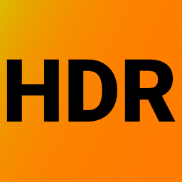

<h1 align="center">
  <br>
  </a>
</h1>
<div align="center">
  <h1><code>hdrToggle</code></h1>
</div>


Minified version of [Brad Gearon's](https://github.com/bradgearon) [hdr-switch](https://github.com/bradgearon/hdr-switch).

## 🛠 Build

Download [NVAPI](https://developer.nvidia.com/gameworksdownload#?search=nvapi) from Nvidia (Version R450 was tested and used) and place it as `R450-developer.zip` into the root of the project directory.

```
mkdir bin
cd bin
cmake ..
cmake --build . --target hdrToggle --config Release
```

The executable can now be found under `./bin/Release/hdrToggle.exe`.

## 🏃‍♂️ Run

```
.\bin\Release\hdrToggle.exe
```


## 📚 Sources

* [hdr-switch - bradgearon | 25.10.2020](https://github.com/bradgearon/hdr-switch)
* [NVAPI - Nvidia | 25.10.2020](https://developer.nvidia.com/gameworksdownload#?search=nvapi)
* [Add icon to executable - Programmierkartoffel | 25.10.2020](https://stackoverflow.com/a/59892158/12347616)